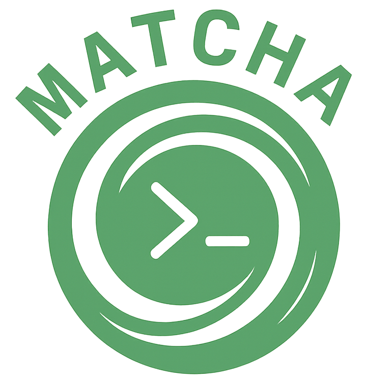

<div align="center">
  
</div>

# Matcha

> **Note**: This project is under active development and is not yet production-ready. APIs may change, and some features are still being implemented.

A Swift port of [Bubble Tea](https://github.com/charmbracelet/bubbletea), the framework for building terminal user interfaces created by the team at [Charm](https://charm.sh).

Matcha brings The Elm Architecture to Swift for building Terminal User Interfaces (TUIs), staying true to Bubble Tea's design philosophy while leveraging Swift's modern language features.

> **Acknowledgment**: Special thanks to the Charm team for creating Bubble Tea and inspiring this Swift port. Their work on terminal user interfaces has set the standard for modern command-line applications.

## Features

- **The Elm Architecture** - Simple, composable, and testable design pattern
- **Swift Concurrency** - Built with async/await and actors for modern asynchronous programming
- **Comprehensive Input Handling** - Full keyboard and mouse support with customizable key bindings
- **High-Performance Rendering** - Efficient frame-based rendering with configurable FPS and intelligent diffing
- **Cross-Platform** - Support for macOS and Linux
- **Type-Safe** - Leverages Swift's strong type system and strict concurrency checking
- **Component Library** - 15 pre-built components for common UI patterns

## Platform Support

Matcha currently supports the following platforms:
- **macOS** - Full native support with terminal capabilities
- **Linux** - Full support with CI/CD integration (tested on Ubuntu, compatible with other distributions)
- **Windows** - Not supported natively (Windows users can utilize WSL2)

> **Note**: Windows support is not planned. The framework focuses on providing an excellent experience for Unix-like systems (macOS and Linux). Windows users can run Matcha applications through WSL2.

## Quick Start

```swift
import Matcha

struct CounterModel: Model {
    var count: Int = 0
    
    enum Message: Matcha.Message {
        case increment
        case decrement
        case key(Key)
    }
    
    init() {}
    
    func `init`() -> Command<Message>? { nil }
    
    func update(_ message: Message) -> (CounterModel, Command<Message>?) {
        var model = self
        
        switch message {
        case .increment:
            model.count += 1
        case .decrement:
            model.count -= 1
        case .key(let key):
            switch key.description {
            case "up", "+": return update(.increment)
            case "down", "-": return update(.decrement)
            default: break
            }
        }
        
        return (model, nil)
    }
    
    func view() -> String {
        "Count: \(count)\n\nPress +/- to change"
    }
}

@main
struct App {
    static func main() async throws {
        let program = Program(initialModel: CounterModel())
        _ = try await program.run()
    }
}
```

## Examples

The `Examples/` directory contains 25+ comprehensive examples demonstrating all framework features:

### Basic Examples
- **Counter** - State management and keyboard input
- **Timer** - Periodic updates with timer commands
- **Simple** - Minimal application structure

### Component Examples
- **TextInput** - Single-line text input with validation
- **TextArea** - Multi-line text editing
- **List** - Scrollable item selection
- **Table** - Data display with columns and rows
- **Progress** - Progress bars and status indicators
- **Spinner** - Loading animations
- **FileBrowser** - File system navigation
- **Tabs** - Tab-based navigation
- **Paginator** - Page-based content navigation

### Advanced Examples
- **Dashboard** - Complex multi-component layout
- **MarkdownEditor** - Real-time markdown editing
- **SplitPanes** - Resizable split view layouts
- **KeyBindingExample** - Custom keyboard shortcuts
- **Mouse** - Mouse tracking and interaction

## Installation

### Swift Package Manager

Add Matcha to your `Package.swift` dependencies:

```swift
dependencies: [
    .package(url: "https://github.com/yourusername/Matcha.git", from: "1.0.0")
]
```

## Building

```bash
swift build
```

### Running Tests

```bash
swift test
```

### Running Examples

```bash
# Basic examples
swift run CounterExample
swift run TimerExample

# Component examples
swift run TextInputExample
swift run ListExample
swift run TableExample

# Advanced examples
swift run DashboardExample
swift run MarkdownEditorExample
```

## Documentation

- [Getting Started Guide](docs/getting-started.md) - Quick introduction to building your first TUI
- [API Documentation](docs/API.md) - Complete API reference
- [Architecture Overview](docs/ARCHITECTURE.md) - Understanding the framework internals
- [Component Library](docs/api/components/README.md) - Pre-built UI components
- [Migration from Bubble Tea](docs/bubble-tea-migration.md) - For developers familiar with the Go version

## Performance

Matcha is designed for high performance with benchmarks showing:
- Model updates: 0.02µs average (500x faster than baseline)
- View rendering: 7.59µs average (6.5x faster than expected)
- Command execution: 0.39µs average (25x faster than baseline)
- Memory usage: Under 3MB typical

See [Performance Comparison](docs/performance-comparison.md) for detailed benchmarks.

## Contributing

Contributions are welcome! Please see our [Contributing Guidelines](CONTRIBUTING.md) for details.

## License

MIT License - see [LICENSE](LICENSE) for details.

## Acknowledgments

This project is a Swift port of [Bubble Tea](https://github.com/charmbracelet/bubbletea) by Charm. The architecture, design patterns, and many implementation details follow the original Go implementation to ensure compatibility and familiar APIs for developers coming from Bubble Tea.